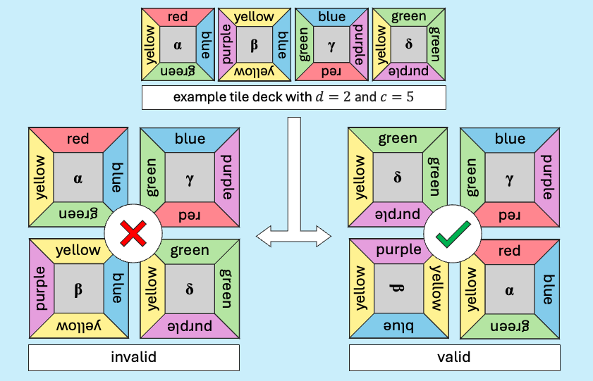
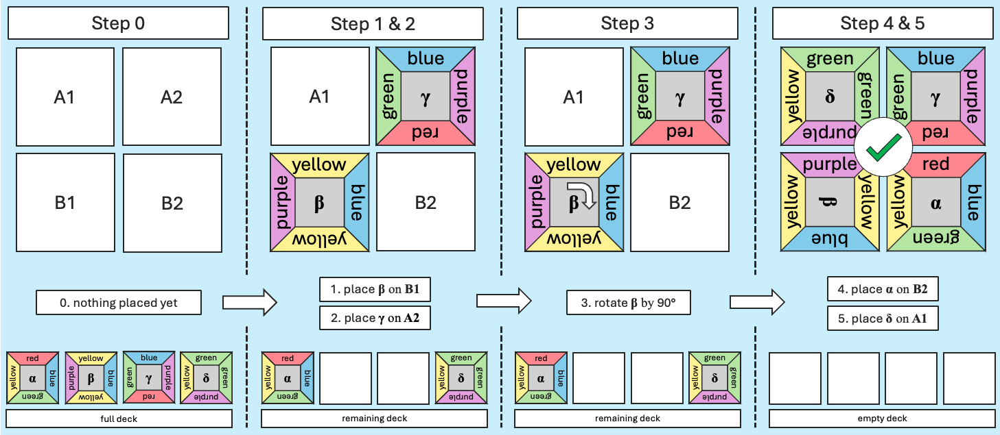

# Recruitment Challenge

## Table of Contents
1. [Introduction](#intro)
2. [The Puzzle Game](#puzzle-game)\
2.1 [Game Objective](#puzzleobjective)\
2.2 [Game Rules](#puzzle-rules)\
2.3 [Puzzle Example](#puzzle-example)\
2.4 [Puzzle Definitions](#puzzle-definitions)
3. [Solving the Challenge](#solving)\
3.1 [Priority](#solving-priority)\
3.2 [Instructions](#solving-instructions)\
3.3 [Challenge Constraints](#solving-constraints)
4. [Submission](#submission)\
4.1 [Evaluation of Your Submission](#sub-eval)\
4.2 [How to Submit Your Solution](#sub-how)

## 1. Introduction
Welcome to the CCS Puzzle Challenge!

The challenge consists of two parts:

   - Part I: Implementation of a full-stack web application
   - Part II: Implementation of a python program

While being independent from each other, both parts are based on the same puzzle game  explained below.

## 2. The Puzzle Game

Like other puzzles, this puzzle game consists of several colored pieces which need to be arranged in a certain way for the puzzle to be solved. The complexity of the puzzle varies depending on the number of pieces ($d^2$) and the number of colors ($c$) used by the puzzle. The nature of each piece, however, is the same: a square tile with four colored sides. Hence, the puzzle pieces shall be called `tiles` from now on.

### 2.1 Game Objective
The goal of the game is to place all $d^2$ tiles in such a way that they make up a $d$ x $d$ square while making sure that the color of a tile's side matches the color of the adjacent tile's side. In other words: Neighbouring tiles need to have the same color on both sides of their border.

|  |
|:--:|
| *Figure 1: Example puzzle with invalid and valid arrangement* |

### 2.2 Game Rules
1. All $d^2$ tiles of the puzzle's tile deck have to be placed in a $d$ x $d$ square.
2. Neighbouring tiles need to have the same color on both sides of their border.
2. The order in which the tiles are placed can be chosen freely.
3. Tiles can be rotated freely and as often as desired (90°, 180°, 270°).

### 2.3 Puzzle Example
The example puzzle shown in *[Figure 1](#fig1)* has a dimension of $d=2$ and a color range of size $c=5$. Together, these define a puzzle specific tile deck consisting of four tiles ($2^2$) and five different colors. To solve the puzzle, the tiles have to be placed in a $2$ x $2$ square while obeying the color matching rule as shown in the *valid* square of *[Figure 1](#fig1)* and *[Figure 2](#fig2)*.

Following the rules described in section *[2.2 Game Rules](#game-rules)*, a player could perform the following actions to solve the example puzzle:

|  |
|:--:|
| *Figure 2: Possible sequence of actions to solve the example puzzle* |

⚠️ It is <ins>important to note</ins> that *[Figure 2](#fig2)* only shows one of many possible action sequences. A player is free to choose the order of actions. For solving a puzzle, it only matters that eventually a valid arrangement is found, independent of how a player arrived at the solution. It is common that a player places a tile, rotates it multiple times, and then puts it back to the deck in order to try different arrangements.

### 2.4 Puzzle Definitions
|
Name
|Definition|
|-|-|
|`d`| $d ∈ \{2,3,4\}$ defines a puzzle's dimension which determines the size of a puzzle's tile deck ($d^2$) and the dimension of a puzzle's solution square ($d$ x $d$).|
|`c`|$c ∈ \{1,2,3,4,5,6,7,8,9,10,11,12\}$ defines the number of different colors used by a puzzle (color range) and is independent of the dimension $d$.|
|`color`|A color is defined by its unique hex color code. E.g. <code>#ff868e</code>|
|`color range`|A puzzle's color range describes a set of unique colors used by the puzzle. It can vary from puzzle to puzzle and is typically chosen by the creator of the puzzle. The size of the color range (number of colors used) is referred to as $c$. Example set for $c=4$: <code>[#ff868e, #82cceb, #b5e5a2, #fff292]</code>.|
|`tile deck`|A puzzle's tile deck is a set of puzzle tiles. The size of a tile deck ($d^2$) refers to the number of tiles in the game.|
|`tile`|A tile is one of the pieces that a puzzle is made of. A tile is defined by its four sides and its unique identifier $i$.
|`tile side`|Each side of a tile has a color from the puzzle's color range assigned. There can be tiles with the same color on multiple sides and there can be multiple tiles with the same constellation of colors in the same tile deck.|
|`neighbor`| Two tiles $\alpha$ and $\beta$ are considered neighbors if a side of $\alpha$ faces a side of $\beta$ (and vice versa).|
|`action`| Each of the following counts as single action: *moving a tile*, *rotating a tile*, and *resetting the tile arrangement*. *Moving a tile* includes, taking a tile from the deck, putting a tile back to the deck, and moving a tile from one position to another in the solution square. Resetting the arrangement means putting all tiles back to the tile deck, in their initial order and orientation.|

## 3. Solving the Challenge

### 3.1 Priority

Both parts of the challenge can be solved independently from each other. Ideally, you should solve both parts. However, should you be constrained by time, you should prioritize Part I over Part II.

### 3.2 Instructions
The part specific instructions and development tasks are further described in the following directories:

[./part-1](./part-1/): Instructions and source files for Part I.

[./part-2](./part-2/): Instructions and source files for Part II.

To solve this challenge, you must follow the instructions given by the README.md files residing in those directories. The source files in the directories should be used as baseline for the solution of the respective part. This means, your solutions should be contained within those directories. Please use git while implementing your solution to keep track of your commit history.

### 3.2 Challenge Constraints
- This challenge is meant to represent a real world scenario, so please implement it just as you would while working in a real office environment.
- This challenge is to be solved by you alone. If this challenge overwhelms you, the actual job will do so, too.
- You are free to use AI assistance tools (e.g. github copilot, chatgpt, ...), web search, documentation, tutorials, etc.
- Additionally, please also respect the part specific development constraints:
   - [Part I: Development Constraints](./part-1/README.md#dev-constraints)
   - [Part II: Development Constraints](./part-2/README.md#dev-constraints)

## 4. Submission

### 4.1 Evaluation of Your Submission
Please note that we will evaluate your submission based on the following aspects, ordered by importance (most important first).
1. Functionality and UX: Does the provided solution work? Does it correctly do what was asked? Does it do so with good usability (i.e. does it provide a good user experience)?
2. Code Quality: Is the code clean, readable, and maintainable? Are best practices followed?
3. Performance: Is the solution scalable? How performant does it work for complex datasets?

### 4.2 How to Submit Your Solution
1. Please pack your solution in a zip file. It should contain the entire repository, including your .git folder and commit history.
2. Please name your zip file by the following format: `firstname_lastname.zip`, where firstname is your first name and lastname is your last name.
3. Please make sure to submit your zip file by following the instructions you received via e-mail along with the invitation to this challenge. In particular
   - submit it before the stated deadline.
   - submit it by uploading it to the linked location.

---

Good luck :)
