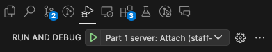

<a name="part-1"></a>

# Part I: Full-Stack Web Application

## Table of Contents
1. [The Task](#task)
2. [Feature Completeness](#completeness)
3. [Requirements](#requirements)\
3.1 [User Authentication](#req-auth)\
3.2 [Puzzle Creation](#req-create)\
3.3 [Puzzle List](#req-list)\
3.4 [Playing a Puzzle](#req-play)\
3.5 [Puzzle Progress](#req-progress)\
3.6 [Puzzle Statistics & User Rankings](#req-statistics)
4. [Development](#development)\
4.1 [Prerequisites](#dev-pre)\
4.2 [Setting Up the Development Environment](#dev-setup)\
4.3 [Debugging](#dev-constraints)\
4.4 [Development Constraints](#dev-constraints)

<a name="task"></a>

## 1. The Task

You are asked to implement a full-stack web application that allows users to play the previously explained [Puzzle Game](../README.md#puzzle-game) (see [../README.md](../README.md)). As described in chapter [3. Requirements](#requirements), users should also be able to sign up, create puzzles, rate puzzles, and view puzzle statistics.

Your implementation should have a clean code structure and follow best practices. You are not asked to implement tests for this part of the challenge.

Please use the code provided in the [`part-1`](../part-1/) directory as the base for this task's solution and extend it by the requested features mentioned below (see [3. Requirements](#requirements)).

Please stick to the technology stack provided by the repository as described in section [4.4 Development Constraints](#dev-constraints).

<a name="completeness"></a>

## 2. Feature Completeness
We are aware that the list of required features is extensive and that implementing them will take a considerable amount of time. If you are constrained by time, please prioritize the features by your own judgement. We value a subset of polished and working features more than a complete list of poorly implemented features. If you'd like to explain something about your submission, please express your thoughts in the [COMMENTS.md](../COMMENTS.md) in the root of the repository.

<a name="requirements"></a>

## 3. Requirements

The application should support the features described below.

<a name="req-auth"></a>

### 3.1 **User Authentication**
Users should be able to sign up and log in to the web application, using a unique e-mail and sufficiently strong password. Users should also be able to log out. Therefore,
   - Implement a client-side modal or page for login, logout, and registration.
   - Implement support for login, logout, and registration on the backend.
   - Implement data structures for this feature as needed (e.g. a `User` class and/or table).
   - Persist the user data upon registration in the database and validate it upon login.

⚠️ Note: There is no need to implement an e-mail verification step.

The following features, which are described further below, shall only be available for logged in users:
   - Puzzle Creation
   - Playing a Puzzle
   - Puzzle Progress

The remaining features shall be available for all users (logged in or not).

<a name="req-create"></a>

### 3.2 **Puzzle Creation**
Users should be able to create new puzzles by providing a [dimension `d`](../README.md#puzzle-definitions), a [color range](../README.md#puzzle-definitions), and a corresponding [tile deck](../README.md#puzzle-definitions). Therefore,
   - Implement a client-side modal or page, dedicated to creating puzzles.
   - Implement support for creating new puzzles on the backend.
   - Implement data structures for this feature as needed.
   - Persist the puzzle data upon creation in the database.

⚠️ Note:
   - The application should only allow solvable puzzles to be created and stored in the database.
   - The application should keep track of which user created which puzzle and when (creator, creation time).
   - This feature should only be available for logged in users.

<a name="req-list"></a>

### 3.3 **Puzzle List**
Users should be able to browse through existing puzzles in a dedicated view. This view should
   - list all existing puzzles
   - allow users to inspect the details of a puzzle (without having to start playing it)
   - allow users to flag puzzles as favorite (every user can have a list of favorite puzzles).
   - allow users to filter and sort puzzles by certain criteria such as: creator, dimension, number of colors, user favorites, create time, progress state (see below), and average rating (see below).

Therefore,
   - Implement a client-side modal or page as described above.
   - Implement support for retrieving the list of existing puzzles, their details, and for flagging a puzzle as one of the user's favorite puzzles.
   - Implement data structures for this feature as needed.

⚠️ Note: This feature should be available for all users (logged in or not).

<a name="req-play"></a>

### 3.4 **Playing a Puzzle**
Users should be able to play existing puzzles (their own, and those of other users). This means that the user should be able to interact with a puzzle's tiles in such a way that it can be solved as described in [Game Objective](../README.md#puzzle-objective), [Game Rules](../README.md#puzzle-rules), and [Puzzle Example](../README.md#puzzle-example) (see [../README.md](../README.md)). Therefore,

   - Implement a client-side modal or page, dedicated to playing a puzzle. I.e. displaying the puzzle data (including the tile deck) and providing a way to interact with and solve the puzzle.
   - Implement support for retrieving a puzzle's data from the backend.
   - Implement data structures for this feature as needed.

⚠️ Note:
   - The application should verify and display the state of the puzzle (i.e. check if the puzzle is solved and announce/display it appropriately).
   - The user interface should allow to reset the tile arrangement to the initial state (i.e. all tiles back to the tile deck in the initial orientation and order).
   - This feature should only be available for logged in users.

<a name="req-progress"></a>

### 3.5 **Puzzle Progress**
The application should keep track of a user's puzzle progress while playing. This comprises:
   - **a timer**: tracking how much time elapses while the user plays the puzzle.
   - **a counter**: tracking how many [actions](../README.md#puzzle-definitions) the user performs while playing the puzzle (see [../README.md#puzzle-definitions](../README.md#puzzle-definitions) to see what counts as action).
   - **a state**: tracking the puzzle state per user. A puzzle can be in one of the following states:
     - *NEW*: User never started playing this puzzle
     - *STARTED*: User started playing this puzzle, but did not solve it yet.
     - *SOLVED*: User solved this puzzle.
   - **the tiles**: tracking the arrangement of tiles. I.e. which tiles are still in the tile deck and which tiles have been placed where and how (position and orientation) on the solution square.

The application should automatically save and load the above described puzzle progress. If a user closes the game (e.g. by closing the browser) and later plays the same puzzle again (from a different browser), the game should continue where it was interrupted. That means, the timer, counter, state and tile arrangement should be remembered and synchronized across different browsers / devices.

Once the puzzle has been solved:
   - the puzzle progress shall freeze. I.e. the progress of this puzzle becomes read only for this user. This user should still be able to reset and re-play this puzzle locally, but it shouldn't affect the puzzle progress anymore.
   - the user should be able to rate the puzzle with a star rating (min. 1 star, max. 5 stars).

Therefore,
   - Extend the "*Playing*" view to display the puzzle progress.
   - Extend the backend so that the puzzle progress can be tracked / saved / loaded.
   - Implement/Extend data structures for this feature as needed.

⚠️ Note:
   - This feature should only be available for logged in users.
   - Make sure to avoid data inconsistencies. E.g. if the same user opens the same puzzle in two browsers
      - performing different actions should not cause data inconsistencies or data loss from either of the browser instances.
      - performing an action should be valid in respect to the current puzzle progress, independent from which browser instance it was performed.
      - the timer should pause if the current user has no browser / tab open on this puzzle's playing view

<a name="req-statistics"></a>

### 3.6 **Puzzle Statistics & User Rankings**
Based on the persisted Puzzle Progress data, certain puzzle statistics can be derived. For example:
   - Average rating
   - Average time to solve
   - Average number of actions to solve
   - Number of STARTED vs. SOLVED states
   - Number of user favorites

Furthemore, user rankings can be derived. For example:
   - Per puzzle
      - User ranking by time to solve
      - User ranking by number of actions to solve
   - Global
      - User ranking by number of puzzles solved

Such statistics could be displayed per puzzle but also as a global statistics view allowing to compare puzzles and users.

Therefore,
   - Implement a client-side modal or page, dedicated to presenting puzzle statistics and/or user rankings.
      - You are free to choose which statistics / rankings you'd like to present.
      - You are free to choose in what way to present the statistics/rankings (tables, plots, ...).
      - You are free to choose and use appropriate front-end libraries (only) for this feature, if you deem it necessary (e.g. a charting library).
   - Implement support for retrieving statistics / rankings from the backend.

⚠️ Note: This feature should be available for all users (logged in or not).

<a name="development"></a>

## 4. Development

<a name="dev-pre"></a>

### 4.1 Prerequisites

#### 4.1.1. Docker
Make sure you installed either A or B:\
A: [Docker Desktop](https://docs.docker.com/desktop/) **OR**\
B: [Docker Engine](https://docs.docker.com/engine/install/) (incl. Docker CLI) **AND** [Docker Compose](https://docs.docker.com/compose/install/).

While you can install *Docker Engine* and *Docker Compose* separately, we recommend installing *Docker Desktop* which includes both. You can download and install *Docker Desktop* from [Docker's official website](https://docs.docker.com/desktop/).

You can verify the installation in your terminal via
```sh
# Verify Docker Engine / CLI
docker version
# Verify Docker Compose
docker compose version
```


#### 4.1.2 ESLint (Optional):
These steps are optional, but needed if you want to configure a JavaScript linter for the project.
1. *Node.js*: Download and install Node.js (v20) from [Node's official website](https://nodejs.org/en/download/package-manager).
2. *npm*: npm v10 is required which should be included in your *Node.js* installation. Verify the installation in your terminal via:
    ```sh
    npm -v
    ```
3. To configure *ESlint* in your IDE, follow [the ESLint documentation](https://eslint.org/docs/latest/use/integrations).
4. If you want to run the linter locally, you need to first install the dependencies inside the client folder:
    ```sh
    # install dependencies (one time action)
    npm i
    # run linter locally
    npm run lint
    ```

<a name="dev-setup"></a>

### 4.2 Setting Up the Development Environment
After installing Docker, run the setup script from the [`part-1`](../part-1/) directory.

⚠️ Note: make sure Docker Daemon is running before running the setup script.

```sh
# run from part-1 directory
./scripts/setup.sh
```
This will create a Docker volume for the database and generate the certificates needed for development. Then, run the following command to start the  application stack:
```sh
# launches four containers: client, server, database, reverse-proxy
docker compose --profile app up -d
```

Once started, you can access the client, the API, and the traefik dashboard via:
- Client: https://localhost:8443/client/#/
- API Server: https://localhost:8443/api
- API Docs: https://localhost:8443/api/docs
- Traefik dashboard: http://localhost:8080/dashboard/#/

The whole stack comes with hot-reloading enabled so you should be able to write code and see the result automatically without any compilation or relaunch steps.

Please let us know if you encounter any issue while trying to launch the provided development environment.


<a name="dev-debugging"></a>

### 4.3 Debugging

---
⚠️ Note: We have been informed that there seems to be an issue with debugging part-1 for some candidates. We are working on a solution and will update the repository / instructions in the coming days.

---
If you have the need for a debugger during development, you can use the following command to run the app's backend within a `debugpy` process that is served on port `5679`:
```sh
docker compose --profile debug up
```
After running the command, you should see a `wait_for_client()` message in the console, which indicates the server is waiting for a debug client to connect to the debug session.

In our section we use the VS Code IDE, so we provide a `vscode` debug configuration (see [.vscode/launch.json](../.vscode/launch.json)) that connects to a running debug session. You'll need the [python debugpy](https://marketplace.visualstudio.com/items\?itemName\=ms-python.debugpy) extension installed if you use VS Code, but you're free to use the setup any other way / with any other client. If you use VS Code, you can connect to the debug session by selecting "Part 1 server" in the `RUN AND DEBUG` field and then pressing the play icon:



<a name="dev-constraints"></a>

### 4.4 Development Constraints
In addition to the general [Challenge Constraints](../README.md/solving-constraints), please also respect the following for Part I specific constraints:
- Please implement your solution with the [Vue.js](https://github.com/vuejs) and [FastAPI](https://github.com/fastapi/fastapi) frameworks.
- Please use [SQLAlchemy](https://github.com/sqlalchemy/sqlalchemy) and the provided Postgres database for persistence.
- Please use the technology versions as specified by the [`client/Dockerfile`](./client/Dockerfile), [`client/package.json`](./client/package.json), [`server/Dockerfile`](./server/Dockerfile) and [`server/requirements.txt`](./server/requirements.txt).
- Please only use packages that are being shipped with the development environment. This concerns both, front-end and back-end. For example, for the front-end, [`client/package.json`](./client/package.json) includes the packages `vue`, `pinia`, and `vuetify` which should be sufficient for completing this challenge.\
**Exception**: You are allowed to use front-end libraries of your choice to implement the [statistics feature](req-statistics). Please indicate your choice clearly (e.g. in [../COMMENTS.md](../COMMENTS.md)).
- We explicitly ask you to use JavaScript and not TypeScript.
- If you feel the strong need for additional libraries/packages, please consult with us (we might have missed something).

---

END OF PART I