<a name="part-2"></a>
# Part II: Python Program

## Table of Contents
1. [The Task](#task)
2. [Format](#format)\
2.1 [Tile Format](#format-tile)\
2.2 [Tile Format Example](#format-tile-example)\
2.3 [Input Format (Tile Deck)](#format-input)\
2.4 [Input Format Example](#format-input-example)\
2.5 [Output Format (Solution Square)](#format-output)\
2.6 [Output Format Example](#format-output-example)
3. [Program](#program)\
3.1 [Run](#prog-run)\
3.2 [Example Run](#prog-run-example)\
3.3 [Debugging](#dev-debugging)\
3.4 [Development Constraints](#dev-constraints)

<a name="task"></a>

## 1. The Task

You are asked to implement a python program which can solve instances of the previously explained [Puzzle Game](../README.md#puzzle-game) autonomously:

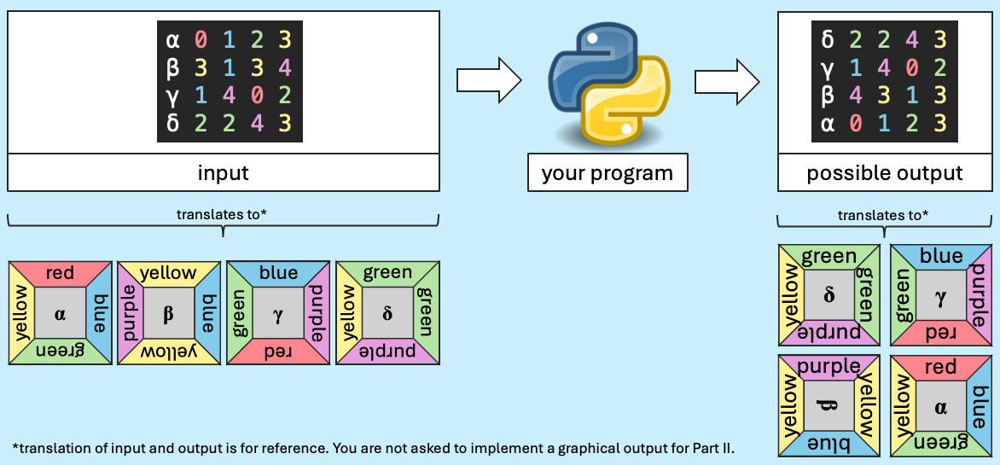

In other words, your program should take a puzzle's tile deck as input and print a valid solution as output, using the specific input and output format described in chapter [2. Format](#format) below.

Your implementation should have a clean code structure and follow best practices. You are advised to implement tests to verify the robustness and correctness of your program.

Please use the code provided in the [`part-2`](../part-2/) directory as the base for this task's solution.

<a name="format"></a>

## 2. Format

<a name="format-tile"></a>

### 2.1 Tile Format
Given is the following format for describing a single puzzle tile:
```python
id top right bottom left
```
|Name|Description|
|-|-|
|`id`|The unique identifier of the tile.|
|`top`|Top side color-idx of the tile.|
|`right`|Right side color-idx of the tile.|
|`bottom`|Bottom side color-idx of the tile.|
|`left`|Left side color-idx of the tile.|

⚠️ Note: *color-idx* refers to the index of a color in a puzzle's [color range](../README.md#puzzle-definitions), starting at `0`. So for the color range <code>[<span style="color: #ff868e">#ff868e</span>, <span style="color: #82cceb">#82cceb</span>]</code>, the color index `0` refers to <code><span style="color: #ff868e">#ff868e</span></code> and index `1` refers to <code><span style="color: #82cceb">#82cceb</span></code>.

<a name="format-tile-example"></a>

### 2.2 Tile Format Example
With the following color range and tile description example

<!---
<pre>
<span style="color: #5ebf54"># color range with four colors (c=4)</span>
[<span style="color: #ff868e">#ff868e</span>, <span style="color: #82cceb">#82cceb</span>, <span style="color: #b5e5a2">#b5e5a2</span>, <span style="color: #fff292">#fff292</span>]
</pre>
-->
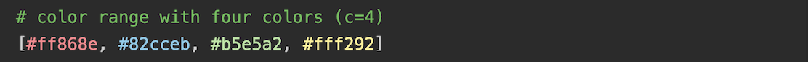

<!--
<pre>
<span style="color: #5ebf54"># tile id, top color-idx, right color-idx, bottom color-idx, left color-idx</span>
ψ <span style="color: #ff868e">0</span> <span style="color: #fff292">3</span> <span style="color: #82cceb">1</span> <span style="color: #b5e5a2">2</span>
</pre>
-->

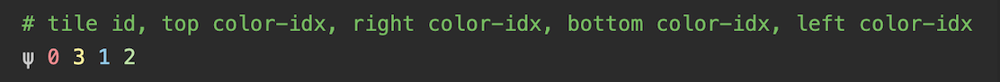

the described tile would look like illustrated below:

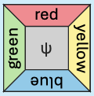

⚠️ Note: The comments in the code snippets are for explanation only and are not part of the input or output format. The same applies to the color encoded characters / numbers.

<a name="format-input"></a>

### 2.3 Input Format (Tile Deck)

To describe the program's input (i.e. a tile deck), we use one line for each tile of the deck. So for a puzzle with dimension $d=2$ (i.e. 4 tiles), the format looks like follows:
```python
id top right bottom left
id top right bottom left
id top right bottom left
id top right bottom left
```
⚠️ Note:
- The line numbers define the order of the tiles in the deck. That means, the first line describes the first tile and the last line describes the $d^2$-th tile.
- The tile ids need to be unique across the tile deck. If an id appears more than once, the input is considered invalid.

<a name="format-input-example"></a>

### 2.4 Input Format Example
With the following color range and program input example

<!--
<pre>
<span style="color: #5ebf54"># color range with five colors (c=5)</span>
[<span style="color: #ff868e">#ff868e</span>, <span style="color: #82cceb">#82cceb</span>, <span style="color: #b5e5a2">#b5e5a2</span>, <span style="color: #fff292">#fff292</span>, <span style="color: #e59edc">#e59edc</span>]
</pre>
-->
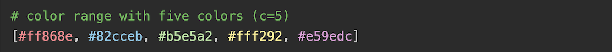

<!--
<pre>
<span style="color: #5ebf54"># tile deck with four tiles (d=2)</span>
α <span style="color: #ff868e">0</span> <span style="color: #82cceb">1</span> <span style="color: #b5e5a2">2</span> <span style="color: #fff292">3</span>
β <span style="color: #fff292">3</span> <span style="color: #82cceb">1</span> <span style="color: #fff292">3</span> <span style="color: #e59edc">4</span>
γ <span style="color: #82cceb">1</span> <span style="color: #e59edc">4</span> <span style="color: #ff868e">0</span> <span style="color: #b5e5a2">2</span>
δ <span style="color: #b5e5a2">2</span> <span style="color: #b5e5a2">2</span> <span style="color: #e59edc">4</span> <span style="color: #fff292">3</span>
</pre>
-->
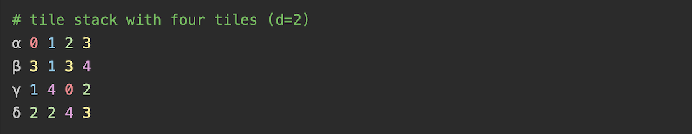

the described tile deck would look like illustrated below:

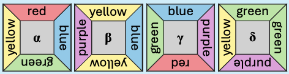

⚠️ Note: The input will be provided to the program as plain text file, without comments, without color range, and without any color encoding. The comments and colored index numbers in this example are for explanation only.

<a name="format-output"></a>

### 2.5 Output Format (Solution Square)
The output format is basically the same as the input format except that it describes a valid solution square instead of a tile deck. This means, the line numbers define the position of tiles in a solution square as illustrated in the $3$ x $3$ ($d=3$) example below:

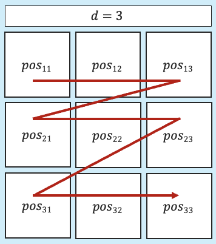

which translates to the following format:

``` python
id top right bottom left # position_11
id top right bottom left # position_12
id top right bottom left # position_13
id top right bottom left # position_21
id top right bottom left # position_22
id top right bottom left # position_23
id top right bottom left # position_31
id top right bottom left # position_32
id top right bottom left # position_33
```

The first line of the program's output maps to the top left tile of a solution square. From there, the line number traverses from left to right, and that row after row. Accordingly, the last line maps to the bottom right tile of a solution square.

⚠️ Note: The comments are for explanation only. The actual program output should not contain any comments.

<a name="format-output-example"></a>

### 2.6 Output Format Example

With the following color range and program output example


<!--
<pre>
<span style="color: #5ebf54"># output: valid solution square (d=2)</span>
δ <span style="color: #b5e5a2">2</span> <span style="color: #b5e5a2">2</span> <span style="color: #e59edc">4</span> <span style="color: #fff292">3</span>
γ <span style="color: #82cceb">1</span> <span style="color: #e59edc">4</span> <span style="color: #ff868e">0</span> <span style="color: #b5e5a2">2</span>
β <span style="color: #e59edc">4</span> <span style="color: #fff292">3</span> <span style="color: #82cceb">1</span> <span style="color: #fff292">3</span>
α <span style="color: #ff868e">0</span> <span style="color: #82cceb">1</span> <span style="color: #b5e5a2">2</span> <span style="color: #fff292">3</span>
</pre>
-->
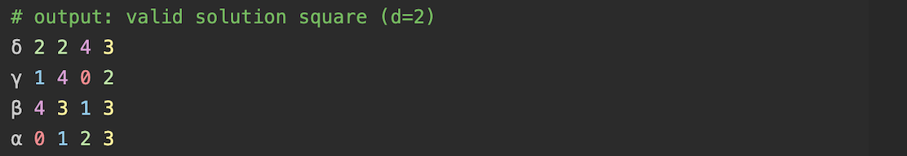

the described solution square would look like illustrated below:

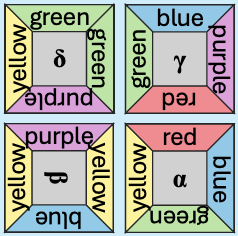

⚠️ Note how, compared to the [input example](#format-input-example) of the previous section, the tile order changed from `αβγδ` to `δγβα` and how the description of *β* changed from `β 3 1 3 4` to `β 4 3 1 3` (due to the 90° rotation).

<a name="program"></a>

## 3. Program

<a name="prog-run"></a>

### 3.1 Run

Your program needs to support being run as follows:
```sh
# run from part-2 directory
python main.py <relative/path/to/file.txt>
```

You are encouraged to use the provided container to ensure your solution runs in the same environment in which we will test it. Use the following commands to run the program within the container while keeping the terminal session alive:
```sh
# run from part-2 directory
docker compose up -d runner
docker exec -it runner bash
python main.py <relative/path/to/file.txt>
```

Alternatively you can also start the container, run the program, and close the session in one shot:
```sh
# run from part-2 directory
docker compose run --rm python main <relative/path/to/file.txt>
```

The input argument of [main.py](./main.py) takes a relative file path as argument. This path should point to a file containing the program's input (e.g. the provided [example.txt](./example.txt)).

The output of the program should simply be printed to the console via python's `print()` function.

<a name="prog-run-example"></a>

### 3.2 Example Run

The repository comes with an example input file ([example.txt](./example.txt)), having the following content:
```sh
α 0 1 2 3
β 3 1 3 4
γ 1 4 0 2
δ 2 2 4 3
```

Calling your program with the example input file

```sh
python main.py example.txt
```

should solve the provided puzzle and print a valid solution, such as

```sh
δ 2 2 4 3
γ 1 4 0 2
β 4 3 1 3
α 0 1 2 3
```

As aforementioned, a puzzle can have multiple valid solutions. Another valid solution and output would be:

```sh
α 2 3 0 1
β 1 3 4 3
γ 0 2 1 4
δ 4 3 2 2
```

The program should only print one of the possible solutions and doesn't need to find more than one.

<a name="dev-debugging"></a>

### 3.3 Debugging
If you have the need for a debugger during development, you can use the following command to start the program within a `debugpy` process that is served on port `5678`:
```sh
docker compose run --rm --service-ports debugger main <relative/path/to/file.txt>
```

After running the command, you should see a `wait_for_client()` message in the console, which indicates the container is waiting for a debug client to connect to the debug session.

In our section we use the VS Code IDE, so we provide a `vscode` debug configuration (see [.vscode/launch.json](../.vscode/launch.json)) that connects to a running debug session. You'll need the [python debugpy](https://marketplace.visualstudio.com/items\?itemName\=ms-python.debugpy) extension installed if you use VS Code, but you're free to use the setup any other way / with any other client. If you use VS Code, you can connect to the debug session by selecting "Part 2 solver" in the `RUN AND DEBUG` field and then pressing the play icon:

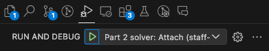

<a name="dev-constraints"></a>

### 3.4 Development Constraints
In addition to the general [Challenge Constraints](../README.md#solving-constraints), please also respect the following for Part II specific constraints:

- Please make sure to use the provided containerized environment to implement your solution. I.e.
  - using python 3.12.
  - not using any additional libraries other than the python standard library.

- About [main.py](./main.py):
    - Use the `run` function as entry point to your solution.
    - Do not modify the signature of the `run` function.
    - Do not modify the `__main__` block.

- We will test your solution against puzzles with dimension $d ∈ \{2,3,4\}$ and with up to twelve different colors.

- We will test your solution with valid and invalid inputs. An input is considered invalid if
  - the provided input file path is invalid (e.g. file doesn't exist).
  - the input file's content doesn't conform with [2.5 Input Format (Tile Deck)](#format-input).

- A valid input can have 0 or more possible solutions.

- An invalid input has exactly 0 possible solutions.

- Your program's output needs to conform to the format specified in section [2.5 Output Format (Solution Square)](#format-output). I.e. for a valid input, your program should only print the solution and nothing else. For invalid inputs, appropriate error handling / reporting should be implemented.

- You are free to choose the architecture and implementation approach of your python program. This means, it is up to you whether you implement your solution as simple script, as python package, with object oriented programming, functional programming, using design patterns, etc. However, you should keep the submission criteria ([4.1 Evaluation of Your Submission](../README.md#sub-eval) of the parent [README.md](../README.md)) in mind.

---

END OF PART II
